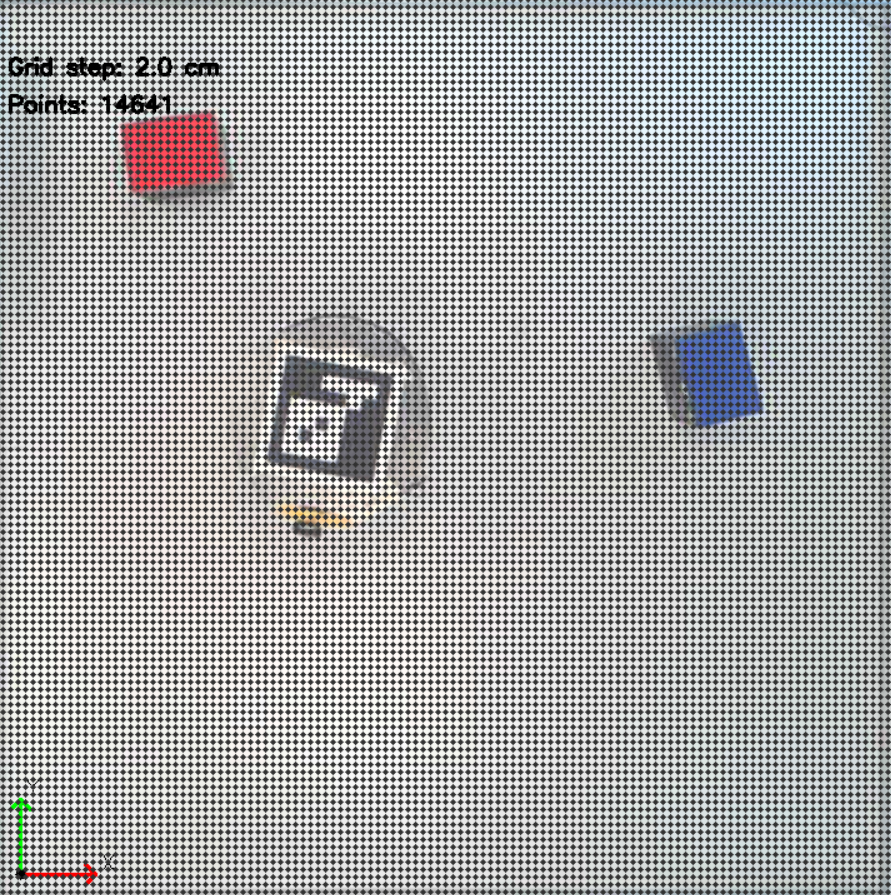
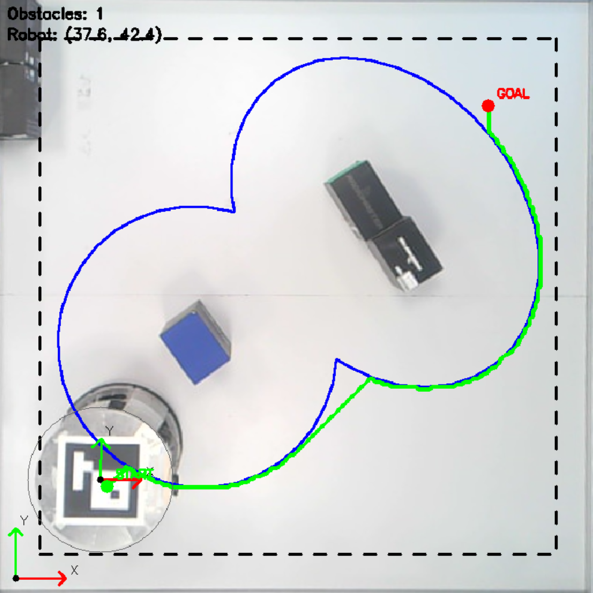
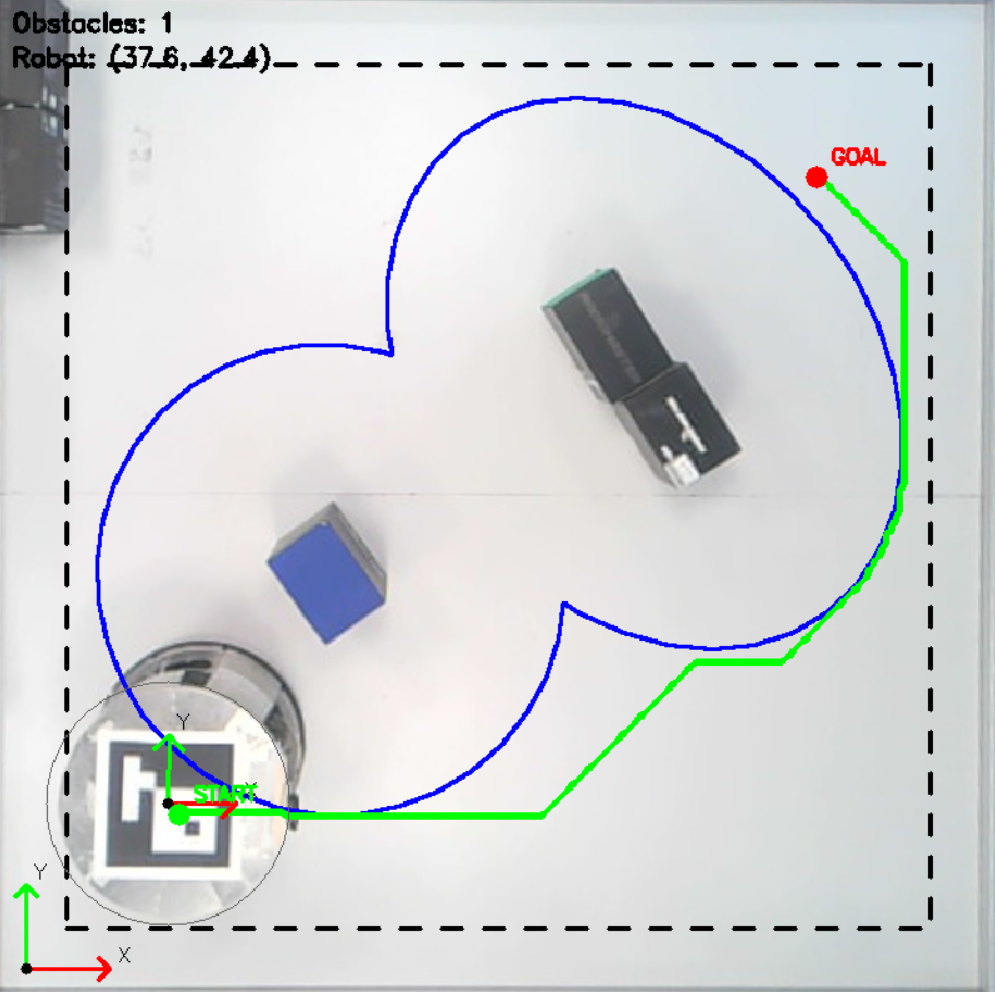
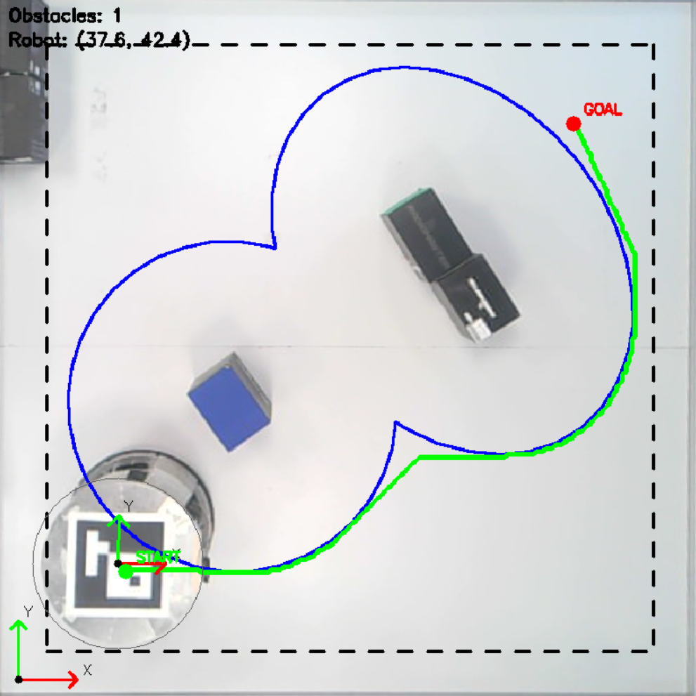

# Обход препятствий мобильным роботом
## Задание

На мобильном роботе необходимо реализовать три метода построения траектории между препятствиями. В качестве методов выбраны: жадный алгоритм, алгоритм Дейкстры и А*. По результатам сравнения алгоритмов необходимо сделать выводы о преимуществах и недостатках их использования.

Над полем, по которому движется робот, установлена камера, транслирующая видео. По диагонали на поле установлены начальная и конечная точка для робота. Определяя препятствия и объезжая их, робот должен прибыть из начальной точки в конечную.

## Обработка видеопотока

Первым этапом будет работа с видеопотоком. Необходимо:
- Провести предобработку видеопотока, выровнять изображение с камеры;
- Идентифицировать положение робота;
- Определить препятствия на поле;
- Реализовать возможность задания координат конечной точки по видеопотоку.

Так как камера установлена не ровно, для обеспечения соответствия определяемых координат робота и препятствий реальным - необходимо выровнять кадры таким образом, чтобы соблюсти реальные пропорции поля. Такая обработка называется гомографией: это математическое преобразование, переводящее точки из одной плоскости в другую с учетом перспективы. Для вычисления гомографии указываются 4 угла поля на первом кадре вручную - они должны расположиться в углах квадрата 720×720 пикселей, т.к. известно, что поле квадратное.

Так как поле и камера статичны, а размеры поля известны - углы записываются в отдельном файле для дальнейшего выравнивания кадров видеопотока и не изменяются без необходимости.

  
  

Для определения положения робота в пространстве и определения его локальной системы координат относительно глобальной системы координат (системы координат поля) будет использоваться AruCo-метка на поверхности робота. ArUco метка - маркер, который используется в компьютерном зрении для определения положения объектов в пространстве. Она представляет собой черно-белое изображение, состоящее из внешней черной рамки и внутренней бинарной матрицы, которая кодирует уникальный идентификационный номер. По ArUco-метке выбираются оси для связной системы координат робота таким образом, чтобы они совпадали с осями координат робота (они изображены на роботе). Результат распознавания метки и оси координат робота представлены на рисунке 1-б.

Контура препятствий выделяются с помощью настройки бинарной маски: таким образом объекты будут распознаваться вне зависимости от цвета. Кадр переводится в оттенки серого, после чего к нему применяется пороговая обработка: в зависимости от значения порога менее яркие пиксели ярче него становятся белыми, а более яркие - черными. Для обработки применяются морфологические операции открытия и закрытия. Операция открытия проводит сначала эрозию, а потом дилатацию, а операция закрытия - сначала дилатацию, а потом эрозию. Эрозия - это метод обработки изображений, который уменьшает или сужает объекты, а дилатация в свою очередь расширяет границы объектов. Это позволяет убрать мелкие объекты и шумы с кадров, исключить из обработки мелкие тени и блики света и выделить основные контура. 

Для каждого выделенного контура вычисляется площадь, проверяется на соответствие размера объекта границам размера препятствия, после чего определяется центр объекта. Далее на препятствии выделяется прямоугольник и определяются его длина и ширина, по которым поверх строится фигура эллипса: это сделано для того, чтобы в случае выставления длинных препятствий на поле безопасное расстояние до препятствия формировалось равномерно в соответствии с его размерами. 

Размер эллипса, по которому в итоге строится маршрут, формируется из радиуса робота и дополнительного расстояния, которое можно прибавить в зависимости от условий выполнения задания.

Эллипс строится по точкам, на которые разбивается поле для построения маршрута (о точках будет написано в следующем разделе). На видео также стоит граница от края кадра: это необходимо потому, что робот перемещается в заданную точку своим центром, поэтому если будет поставлена точка на краю кадра - робот не сможет в нее приехать и врежется в край поля.

  

В результате на видео выводятся:
- контура препятствий с запасом по расстоянию;
- контур робота;
- контур по краю кадра;
- количество препятствий;
- координаты робота;
- стартовая и целевая точки.

## Алгоритм и условия движения

Так как большинство методов построения маршрута являются графовыми (или дискретными), то есть строятся по точкам - то обрабатываемый кадр разбивается на точки, по которым будет строиться путь. В зависимости от заполнения кадра точками маршрут будет строиться точнее, но дольше.

  

Так как необходимо сравнить работу трех разных алгоритмов - то начальная и конечная точка задаются на поле программно. На основе пути, построенного алгоритмом, формируются скорости, необходимые для достижения цели: в зависимости от значения ошибки по координатам и средней ошибки. Для управления роботом используется П-регулятор: чем больше расстояние до цели, тем больше скорость. После того как робот приближается к финальной цели на расстояние меньше 5 см - движение считается завершенным.

В процессе отладки приняты следующие условия:
- так как на кадре изображено привычное расположение осей координат, а на роботе ось Y направлена в противоположную сторону - то скорость на робота подается с минусом;
- робот будет двигаться голономно, поэтому угловая скорость равна 0, а оси координат должны совпадать с осями глобальной системы координат (быть им параллельными).

Для соблюдения второго условия перед началом движения робота по пути добавлена проверка: если ошибка по углу ориентации больше некоторого значения, то робот сначала выравнивает угол, а потом едет.

Robotino имеет встроенный веб-сервер, который принимает HTTP-запросы для управления движением по Wi-Fi. Адрес для отправки команд - /data/omnidrive. Полный URL выглядит так: http://192.168.0.1/data/omnidrive, где 192.168.0.1 - это IP-адрес робота в локальной сети. Тело запроса представляет собой JSON-массив из трёх чисел: [vx, vy, omega].

### Жадный алгоритм

Первым реализуемым алгоритмом выбран жадный алгоритм: он представляет собой принятие на каждом этапе построения маршрута локально оптимального решения.

Сначала проверяется, безопасна ли точка, где находится робот. При постановке точки на поле - проверяется безопасна ли она. После этого в файле жадного алгоритма происходить поиск маршрута: на каждой итерации поиска алгоритм анализирует все соседние клетки вокруг текущей. Если соседняя точка безопасна и алгоритм ее еще не проверял, то для него вычисляется эвристика - евклидово расстояние до целевой клетки. После того как алгоритм вычислил эвристики для всех допустимых клеток, он выбирает ту, у которой эвристика оказалась наименьшей. Новая лучшая точка становится текущей, а ее связь с предыдущей точкой записывается в словарь, чтобы потом возможно было восстановить весь маршрут. 

Когда текущая клетка попадает в целевую, алгоритм начинает восстанавливать маршрут. Для этого он берет целевую клетку и, используя словарь, последовательно переходит к родительским клеткам, пока не дойдет до стартовой. После этого каждая клетка преобразуется обратно в реальные координаты. Путь, полученный после восстановления, может содержать много точек, которые лежат на одной прямой, что делает его избыточным, поэтому робот едет не к следующей точке, пропуская несколько.

На основе пути, построенного алгоритмом, формируются скорости, необходимые для достижения цели: в зависимости от значения ошибки по координатам и средней ошибки Для управления роботом используется П-регулятор: чем больше расстояние до цели, тем больше скорость. После того как робот приближается к финальной цели на расстояние меньше 5 см - движение считается завершенным.

Результаты построения маршрута по жадному алгоритму представлены ниже.

  

### Алгоритм Дейкстры

Алгоритм Дейкстры находит кратчайший путь от начальной вершины до всех остальных, равномерно исследуя все направления, учитывая веса ребер и гарантируя оптимальность, но работает медленнее эвристических методов.

Рабочее поле представляется в виде сетки, где каждая клетка - это узел графа, а переход между соседними клетками - это ребро с весом, равным расстоянию между их центрами (шаг сетки или корень из двух, умноженный на шаг, если ход диагональный). В начале работы алгоритма всем узлам присваивается бесконечная стоимость, кроме стартовой точки, которой присваивается ноль. Создается очередь с приоритетом, в которую помещается стартовая позиция с нулевой стоимостью. Алгоритм последовательно извлекает из очереди узел с наименьшей накопленной стоимостью. Алгоритм рассматривает всех возможных соседей текущей клетки (включая диагональные). Для каждого соседа вычисляется новая стоимость как сумма стоимости текущего узла и веса ребра к соседу. Если эта новая стоимость оказывается меньше текущей записанной стоимости для этого соседа, то значение обновляется, родителем соседа становится текущая клетка, и сосед добавляется в очередь с приоритетом. Этот процесс повторяется до тех пор, пока очередь не опустеет или не будет найдена целевая точка. Если извлеченный узел оказывается целевой точкой, алгоритм останавливается и восстанавливает путь по сохраненным родительским связям. 

Алгоритм Дейкстры не использует эвристику, то есть не делает предположений о направлении к цели, а просто распространяется волной равномерно во все стороны, что гарантирует нахождение кратчайшего пути по сумме весов ребер, но может быть медленнее на больших картах по сравнению с A*.

Аналогично тому, что описано в разделе по жадному алгоритму - восстанавливается маршрут и формируются скорости для движения по нему.

Результаты построения маршрута по алгоритму Дейкстры представлены на рисунке ниже.

  

### Алгоритм А*

A* сочетает достоинства Дейкстры и жадного алгоритма, используя эвристику (оценку расстояния до цели) для ускорения поиска, что делает его наиболее популярным для задач навигации.

Алгоритм A*, как и алгоритм Дейкстры, работает с сеткой, где каждая клетка - это узел графа, а переходы между соседними клетками имеют веса, равные евклидову расстоянию. Ключевое отличие A* заключается в использовании эвристической функции, которая оценивает расстояние от текущей клетки до цели. В начале работы алгоритма всем узлам присваивается бесконечная стоимость (фактическая стоимость от старта), за исключением стартовой точки, которой присваивается ноль. Также для стартовой точки вычисляется эвристика, и сумма стоимости с эвристикой помещается в очередь с приоритетом. На каждом шаге алгоритм извлекает из очереди узел с наименьшим значением суммы. В противном случае для всех соседей текущей клетки вычисляется новая стоимость из предыдущей стоимости и веса нового ребра. Если новая стоимость оказывается меньше записанной стоимости для соседа, то обновляется стоимость соседа, пересчитывается его эвристика и сумма, родителем соседа становится текущая клетка, и сосед добавляется в очередь. Если этот узел является целевой точкой, алгоритм завершается и восстанавливает путь по родительским ссылкам. 

Благодаря эвристике A* направляет поиск в сторону цели, что делает его значительно быстрее алгоритма Дейкстры на больших картах, при этом сохраняется гарантия оптимальности при условии, что эвристика является допустимой (не переоценивает расстояние до цели).

Результаты построения маршрута по А* представлены на рисунке 6.

  

## Сравнение алгоритмов

Для сравнения алгоритмов все алгоритмы были проверены на карте попроще и посложнее. В качестве критериев сравнения были выбраны:
- Длина пути;
- Время, затраченное алгоритмом на построение маршрута;
- Время прохождения маршрута роботом;
- Средняя скорость движения робота;
- Средняя квадратичная ошибка отклонения робота от маршрута;
- Коэффициент детерминации.

| Параметр | Жадный | Дейкстра | A* |
|----------|--------|----------|-----|
| Длина пути, см | 301.5 | 287.2 | 275.0 |
| Время построения маршрута, мс | 1.00 | 95.00 | 62.92 |
| Время прохождения, с | 26.16 | 24.23 | 23.86 |
| Средняя скорость, см/c | 10.61 | 10.51 | 10.28 |
| RMSE, см | 0.83 | 0.68 | 0.49 |
| R² | 0.99 | 0.99 | 1.00 |

Проведенное сравнение алгоритмов показало следующие результаты. Жадный алгоритм демонстрирует наименьшее время построения маршрута (1 мс), однако строит наиболее длинный путь (301,5 см) и уступает другим алгоритмам по времени прохождения (26,16 с). Алгоритм Дейкстры обеспечивает более короткий путь (287,2 см) и лучшее время прохождения (24,23 с), но требует значительно больше времени на построение (95 мс). Наилучшие показатели длины пути (275,0 см) и времени прохождения (23,86 с) достигнуты с помощью алгоритма A*. По средней скорости все три алгоритма показали близкие значения (10,28–10,61 см/с).

## Заключение

В результате выполнения лабораторной работы была разработана система управления с техническим зрением для навигации мобильного робота Robotino на ограниченном поле с препятствиями. Робот обнаруживается с помощью использования AruCo-метки, препятствия детектируются с помощью бинарной маски с последующим выделением контуров и построением эллиптических областей безопасности. Реализованы три алгоритма поиска пути: жадный алгоритм, алгоритм Дейкстры и алгоритм A*. 

В результате сравнения было принято решение, что для задач, требующих высокой точности и оптимальности траектории, предпочтительным является алгоритм A*, в то время как жадный алгоритм может быть полезен в сценариях, критичных к времени вычислений.

